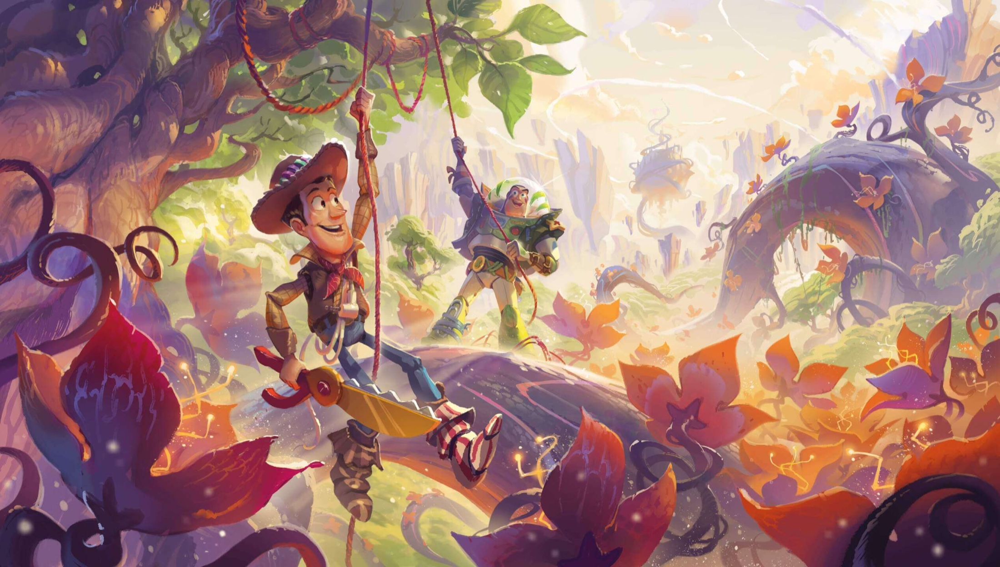

<div align="center">

# The Inkcaster

**A full-stack Disney Lorcana card browser, collection tool, and deck workshop.**

[](https://react.dev/)
[](https://vite.dev/)
[](https://mui.com/)
[](https://nodejs.org/)
[](https://www.mongodb.com/)
[](LICENSE)



</div>

## Overview

The Inkcaster helps Lorcana players explore the card catalog, compare special printings, check current TCGplayer values, and build decks that can be saved to a personal account. Its interface uses a dark ink-inspired palette with purple, gold, and deep-blue accents.

## Highlights

### Card archive

- Responsive card grid with continuous loading
- Name search across standard, Enchanted, Epic, and Iconic printings
- Filters for ink color, cost, type, rarity, inkability, set, and promo release
- Newest-set, oldest-set, alphabetical, and ink-cost sorting
- Complete set and promotional catalogs, including EPCOT and challenge promos
- Card detail modal with artwork, classifications, rules text, set, rarity, and collector number

### Market values

- Current TCGplayer market and lowest-listing prices
- Exact product matching for promotional cards
- Variant-aware matching that prevents normal cards from being priced as Enchanted cards
- Six-hour server-side cache to limit repeated Apify usage
- Graceful fallback when pricing is unavailable or not configured

### Deck workshop

- Search and browse cards while building
- Add up to four copies of a card
- Organize selected cards by card type
- Name, save, edit, and delete decks
- View saved decks from an authenticated profile

### Accounts

- Email and password registration and login
- JWT-based authentication
- Password hashing with bcrypt
- User-specific deck storage in MongoDB

## Tech Stack

| Area | Technology |
| --- | --- |
| Client | React 18, Vite, React Router, Material UI |
| Data client | Apollo Client, GraphQL |
| Server | Node.js 20, Express, Apollo Server |
| Database | MongoDB, Mongoose |
| Authentication | JWT, bcrypt |
| Card data | Lorcast and Lorcana API |
| Pricing | Apify TCGplayer Data Scraper |

## Local Setup

### Requirements

- [Node.js 20](https://nodejs.org/)
- npm
- A local MongoDB server or hosted MongoDB connection string
- An optional [Apify](https://apify.com/) token for live card pricing

### Installation

```bash
git clone git@github.com:Jramos20022/lorcanaCollection.git
cd lorcanaCollection
nvm use 20
npm install
```

The root installation installs the server and client dependencies.

### Environment

Copy the server example file:

```bash
cp server/.env.example server/.env
```

Configure the values you need:

```env
# Optional when MongoDB is running locally at the default address
MONGODB_URI=mongodb://127.0.0.1:27017/illuminearsDB

# Optional; required only for live TCGplayer pricing
APIFY_TOKEN=your_apify_api_token
```

`server/.env` is ignored by Git. Never commit API tokens or database credentials.

### Run the app

Make sure MongoDB is running, then start the client and server together:

```bash
npm run develop
```

Open [http://localhost:3000](http://localhost:3000). The API runs at `http://localhost:3001`, with GraphQL available at `/graphql`.

## Scripts

| Command | Purpose |
| --- | --- |
| `npm run develop` | Run the Vite client and Node server together |
| `npm run build` | Create the production client bundle |
| `npm start` | Start the Node server |
| `cd client && npm run lint` | Check client source with ESLint |
| `cd client && npm run preview` | Preview a production client build |

## Project Structure

```text
illuminears/
├── client/                 React and Material UI application
│   └── src/
│       ├── components/     Navigation, card archive, and deck tools
│       ├── pages/          Home, cards, builder, profile, and auth routes
│       └── utils/          Theme, authentication, queries, and mutations
├── server/                 Express and Apollo GraphQL server
│   ├── models/             User and deck models
│   ├── routes/             TCGplayer pricing endpoint
│   ├── schemas/            GraphQL schema and resolvers
│   └── utils/              Authentication helpers
└── scripts/                Local development launcher
```

## Data and Pricing

Card records are loaded from third-party Lorcana catalogs. TCGplayer prices are requested through the [Apify TCGplayer Data Scraper](https://apify.com/devcake/tcgplayer-data-scraper) by the server, keeping the Apify token out of browser code.

Special and promotional cards are matched using rarity information and exact TCGplayer product IDs when available. Prices are informational and may change between requests.

## Contributing

1. Fork the repository.
2. Create a branch: `git switch -c feature/your-feature`.
3. Make and test your changes.
4. Commit and push the branch.
5. Open a pull request with a clear description and screenshots for visual changes.

## Contributors

- [Justin Ramos](https://github.com/Jramos20022)
- [Nicholas Poulson](https://github.com/42Salokin)
- [Emanuel Velazquez](https://github.com/Velazqe)

## License

This project is available under the [MIT License](LICENSE).

## Disclaimer

The Inkcaster is an independent fan project. Disney Lorcana, its characters, card artwork, and related properties belong to their respective owners. This project is not affiliated with or endorsed by Disney, Ravensburger, TCGplayer, Lorcast, or Apify.
